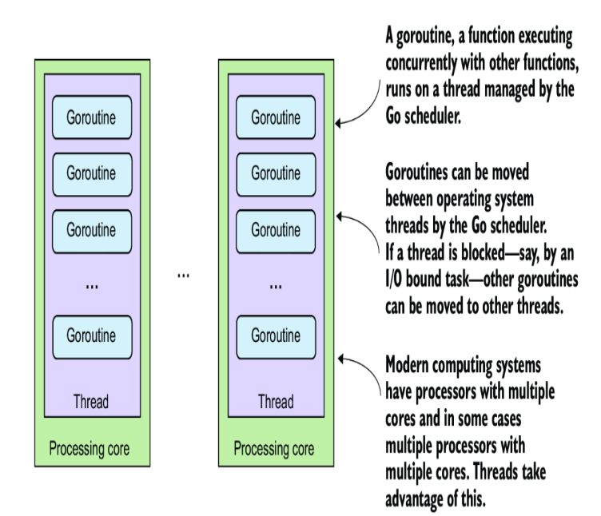
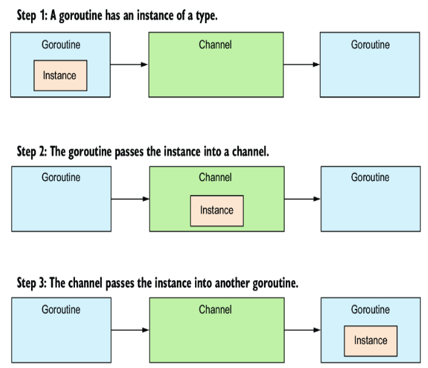

# 1. What is Go
*Go* or *golang* is a statically typed and copiled open source programming language initially developed by Google. <br>

Go is special in the sense that while simple, it also comprises a whole ecosystem. Go supports its own development toolchain, which provides tools for testing, documentation, formatting & more and a native package management. 

# 2. Noteworthy aspect of go
## 2.1 Multiple return values
Go is one of the few languages that natively supports multiple return values for functions.
```go
func getStrings() (string, string) {
    return "String1", "String2"
}

func main() {
    n1, n2 := getStrings()
    n1, _ := getStrings()
    _, n1 := getStrings()
}
```
The most common way you can see that in practise is in error return values, as error return value is usually the last variable:
```go
a, b, err := someFunc()
```
## 2.2 A modern standard library
There are lots of stdlib packages that solve a huge variety of different tasks.

## 2.3 Concurrency with goroutines and channels
Golang was designed to work with multiple cores from the start. <br>
it has a feature called *goroutine*, which is a function that can be run concurrently with the main program or other goroutines. <br/>
Goroutines are managed by the Go runtime, where they are mapped and moved to the appropriate operating system thread and garbage-collected when no longer needed. <br/>
**! check about event-drive and async/await approaches in other languages.** <br/>


Channels provide a way for two goroutines to communicate with each pther or anohe process. By default, they block execution, allowing goroutines to synchronise. <br/>

Channels can be one-directional or bidirectional, controlled by syntax that indicates the data direction: <- or ->.

Here is a simple example of chnnel usage:
```go
package main

import (
    "fmt"
    "time"
)

func printCount(c chan int) {
    num := 0
    for num >= 0 {
        num = <-c
        fmt.print(num, " ")
    }
}

func main() {
    c:= make(chan int)
    a := []int{8, 6, 7, 5, 3, 0, 9, -1}
    go printCount(c)
    for _, v := range a {
        c <- v
    }
    time.Sleep(time.Millisecond * 1)
    fmt.Println("End of main")
}
```
Here we iterate through an array and send all o its values to a channel, and the chanel is being listened by a goroutine started previously. The goroutine executes a function that prints values from a channel until the first negative value appears. 
## 2.4 Go toolchain

# 3. Go in the vast language landscape

# 4. Getting up and running in go

# 5. Hello, Go